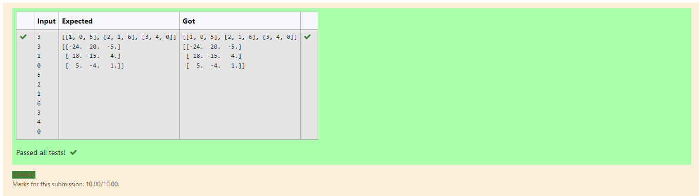

# Inverse-of-matrix

## AIM:

## ALGORITHM:
### Step 1:
import numpy module
### Step 2:
Declare a variables l1 and l2 as a empty list
### Step 3:
Get the input of the variables n and m
### Step 4:
Loop a variable i in the range of n and nest loop a variable j in range m
### Step 5:
Loop a variable i in the range of n and nest loop a variable j in range m

## PROGRAM:
~~~
import numpy as np
l1,l2 = [],[]
r,c=int(input()),int(input())
for i in range(r):
    for j in range(c):
        num=int(input())
        l1.append(num)
    l2.append(l1)
    l1=[]
print(l2)
value1=np.array(l2)
inverse = np.linalg.inv(value1)
print(inverse)

~~~

## OUTPUT:

## RESULT:
